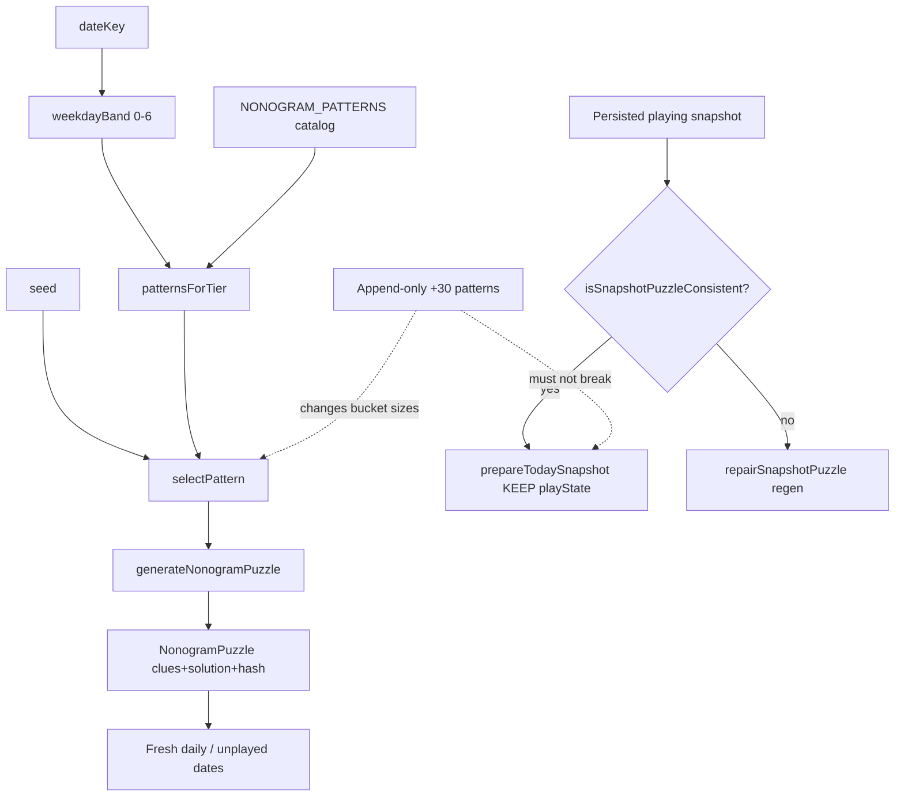

# Phase v2.4.2-02: Nonogram Expand（数绘扩库） - Research

**Researched:** 2026-07-27
**Domain:** Curated nonogram pattern catalog expansion (static content + tests + SHIP-02 fixture)
**Confidence:** HIGH

<user_constraints>
## User Constraints (from CONTEXT.md)

### Locked Decisions

#### Exact count & tier split

- **D-01:** 目标规模 **正好 120**（不是软区间）。
- **D-02:** Tier 直方图目标 **17/17/17/17/17/17/18**（现 13/13/13/13/13/13/12 → 先补齐 tier 6，再各 +4）。
- **D-03:** 单测断言 **精确** 该直方图与 `length === 120`（不允许 ±1 裁量）。
- **D-04:** 某稿不过 8×8 / 唯一性等 QA → **remake 直到凑满 120**，不得降规格。

#### Content authorship

- **D-05:** **Claude 全权创作**并直接合入 `patterns.ts` + zh/en locales（同 v24-02 流程）。
- **D-06:** 主题延续 **混搭傻气剪影**（食物 / 动物 / 物件 / 胡闹混搭），不单偏某一类。
- **D-07:** 标题语气保持 **短、损一点、可认出物件**（现库「短路机器人」档）。
- **D-08:** 新条目继续填写废弃字段中文 **`title`**，与现库形状一致；展示仍以 locales 为准。

#### Prefix lock depth

- **D-09:** 冻结 **前 90** 条的 **id 顺序 + rows + tier**（字节级不可改）；新图只能 **append**。
- **D-10:** 新 `id` / `titleKey`：**kebab-case 英文 slug，且 `titleKey === id`**。
- **D-11:** 测试落地：扩展 `__tests__/lib/puzzles/nonogram/patterns.test.ts` —— **冻结前 90 expected-id 列表** + length/tier 精确断言（可读，不要求 rows hash）。

#### SHIP-02 nonogram fixtures

- **D-12:** **加强**现有 `__tests__/lib/storage/fixtures/stale-playing-nonogram.json`（替换最小盘），底板用前缀库图 **`silly-face`**。
- **D-13:** 「过时」用 **故意 stale 的 `puzzleHash` 字符串**；puzzle 结构仍须通过 `isSnapshotPuzzleConsistent`。
- **D-14:** `snapshotPrep.ship02` **仍为四题型同一 suite**；只升级 nonogram 那条 fixture/断言，**不**额外要求 fixture rows 与 catalog 再做一次硬对齐断言（fixture 内容来自 silly-face 即可）。

### Claude's Discretion

- 具体 30 张新图的题材选题与像素稿（须满足 D-06/D-07、全 8×8、可解/自洽线索）。
- expected-id 冻结列表的维护方式（内联数组 vs 从当前 HEAD 导出一次后锁死）。
- `silly-face` fixture 的 playState 局部进度怎么填（非空即可）。
- 是否顺手清理/更新 patterns 测试里旧的「84–98 / 12–14」带宽文案。

### Deferred Ideas (OUT OF SCOPE)

None — discussion stayed within phase scope.

（变盘披露文案 / Maestro / `app.json` 2.4.2 仍属 v2.4.2-03。）
</user_constraints>

<phase_requirements>
## Phase Requirements

| ID | Description | Research Support |
|----|-------------|------------------|
| NONO-01 | Library 90 → ~120 8×8, tiers roughly balanced, append-only prefix lock | **CONTEXT overrides** soft ≈120 / ±1 → exact `120` + hist `17/17/17/17/17/17/18`. Append +30 after frozen prefix; RED/GREEN catalog asserts; fill tier 6 first (+6), then +4 each on tiers 0–5. |
| NONO-02 | Every new pattern has zh + en titles via `titleKey` / locales | Append keys to `locales/zh/patterns.ts` + `locales/en/patterns.ts`; keep existing parity test (`titleKey === id`, non-empty zh/en for every id). |
</phase_requirements>

## Summary

This phase is a **content-only catalog expansion** of `NONOGRAM_PATTERNS` from **90 → exactly 120**, following the v24-02 append-only RED→GREEN pattern. Generator selection (`patternsForTier` → `selectPattern` → `generateNonogramPuzzle`), `APP_SALT`, `dailySelector` weights, and UI are **untouched**. Cross-version bucket drift for *unplayed* dates remains accepted; in-progress days are protected by SHIP-02 `prepareTodaySnapshot` keep-if-consistent.

**ROADMAP / REQUIREMENTS still say ≈120 and tier ±1.** CONTEXT **D-01/D-02/D-03 override** those soft criteria to **exact length 120** and **exact histogram `[17,17,17,17,17,17,18]`**. Planner success criteria and tests must use CONTEXT, not ROADMAP wording.

**Primary recommendation:** TDD like v24-02 — (1) RED: upgrade `patterns.test.ts` to `length === 120`, exact tier hist, `PREFIX_IDS` length 90; (2) GREEN: append exactly 30 patterns (+6 tier6, +4× tiers 0–5) + zh/en titles; (3) replace `stale-playing-nonogram.json` with `silly-face`-derived puzzle + deliberate stale hash; leave `snapshotPrep.ship02.test.ts` suite structure unchanged.

## Architectural Responsibility Map

| Capability | Primary Tier | Secondary Tier | Rationale |
|------------|-------------|----------------|-----------|
| Pattern catalog (`NONOGRAM_PATTERNS`) | Client (static module) | — | Offline curated data in `lib/puzzles/nonogram/` |
| Tier pool selection | Client (`patternsForTier` / generator) | — | Pure JS; no network |
| Picture titles | Client (i18n locales) | — | `titleKey` → zh/en maps; deprecated `title` kept for shape |
| Catalog / prefix / parity QA | Test (Jest) | — | `patterns.test.ts` |
| In-progress keep-on-stale-hash | Client (`prepareTodaySnapshot`) | Test (SHIP-02) | Consistency gate only; fixture supplies stale hash |
| Daily type weights / salt | **Do not touch** | — | Out of scope; would break determinism product rules |

## Project Constraints (from AGENTS.md / .cursor/rules/)

Actionable directives that constrain this phase:

| Source | Directive |
|--------|-----------|
| AGENTS.md | **Daily determinism** — no `APP_SALT` / `deriveSeed` / selection weight changes without product approval |
| AGENTS.md | **Offline-first** — no network for puzzle generation/validation/persistence |
| AGENTS.md | **Storage safety** — never silently drop progress; SHIP-02 keep path must stay green |
| AGENTS.md | Puzzle algorithms live in `lib/puzzles/`; `app/` / UI not for algorithms |
| AGENTS.md | All user-facing strings via i18n — new titles go in `locales/{zh,en}/patterns.ts` |
| AGENTS.md | TypeScript strict; no `any` |
| Guidelines.mdc (Karpathy) | Surgical changes only; no speculative abstractions; verify with failing→passing tests |
| CLAUDE.md GSD | No file edits outside GSD workflow (this research is inside `/gsd-plan-phase`) |
| Phase scope | **No new npm packages. No UI changes.** |

## Standard Stack

### Core

| Library | Version | Purpose | Why Standard |
|---------|---------|---------|--------------|
| Existing Jest | project `npm test` | Catalog + SHIP-02 asserts | Already covers patterns / ship02 |
| Existing TypeScript / Expo | SDK 54 | App runtime | Unchanged |
| In-repo nonogram modules | current HEAD | `patterns`, `clues`, `generator`, `validate` | No new deps |

### Supporting

| Library | Version | Purpose | When to Use |
|---------|---------|---------|-------------|
| `tsx` (dev) | already usable via `npx tsx` | One-shot export of PREFIX_IDS / silly-face clues | Discretion: generate frozen id list once |

### Alternatives Considered

| Instead of | Could Use | Tradeoff |
|------------|-----------|----------|
| Exact hist asserts | Soft ±1 (ROADMAP) | **Rejected by D-03** |
| New uniqueness solver package | Existing self-consistency tests | No nonogram multi-solution counter in repo; do **not** add a package or hand-roll solver this phase |
| Rows hash lock | Readable id list (D-11) | D-09 still forbids mutating prefix rows; enforce via append-only + CR, not hash |

**Installation:** none — **no new packages**.

## Package Legitimacy Audit

> No external packages are installed in this phase.

| Package | Registry | Age | Downloads | Source Repo | Verdict | Disposition |
|---------|----------|-----|-----------|-------------|---------|-------------|
| — | — | — | — | — | N/A | No installs |

**Packages removed due to [SLOP] verdict:** none
**Packages flagged as suspicious [SUS]:** none

## Architecture Patterns

### System Architecture Diagram



### Recommended Project Structure (touch list only)

```
lib/puzzles/nonogram/patterns.ts          # APPEND 30 NonogramPattern entries
locales/zh/patterns.ts                    # +30 zh titles
locales/en/patterns.ts                    # +30 en titles
__tests__/lib/puzzles/nonogram/patterns.test.ts   # exact 120 / hist / PREFIX_IDS×90
__tests__/lib/storage/fixtures/stale-playing-nonogram.json  # silly-face board + stale hash
# DO NOT TOUCH:
#   constants/config.ts (APP_SALT)
#   lib/puzzles/dailySelector.ts (weights)
#   lib/puzzles/nonogram/generator.ts (selection logic)
#   app/, components/ (UI)
#   snapshotPrep.ship02.test.ts structure (fixture path only; suite stays 4-way)
```

### Pattern 1: Append-only catalog growth (v24-02)

**What:** Freeze prefix ids; append new objects at end of `NONOGRAM_PATTERNS`; never reorder/edit earlier entries' `id`/`rows`/`tier`.
**When to use:** Every content expansion of the nonogram library.
**Example (shape of one entry):**

```typescript
// Source: lib/puzzles/nonogram/patterns.ts [VERIFIED: codebase]
{
  id: 'robot',
  tier: 4,
  titleKey: 'robot', // === id (D-10)
  title: '短路机器人', // deprecated field, still filled (D-08)
  rows: [
    '00111100',
    '01111110',
    // ... exactly 8 strings of /^[01]{8}$/
  ],
}
```

### Pattern 2: RED → GREEN catalog asserts (v24-02)

**What:** Commit failing length/tier/prefix tests first; then append data until green; then locale parity.
**When to use:** This phase (NONO-01/02).
**Evidence:** `v24-02-SUMMARY.md` — Task1 RED `892f1db` → GREEN `fe80346`; Task2 RED/GREEN for locales. [VERIFIED: v24-02-SUMMARY.md]

### Pattern 3: SHIP-02 keep-if-consistent

**What:** Fixture has valid puzzle shape + non-empty playState + `puzzleHash` ≠ canonical generator hash → `prepareTodaySnapshot` must keep puzzle/playState.
**When to use:** After any catalog change that could alter `selectPattern` buckets.
**Evidence:** `snapshotPrep.ship02.test.ts` + `isValidNonogramPuzzle` (shape only; does not re-check clue↔solution). [VERIFIED: codebase]

### Anti-Patterns to Avoid

- **Editing prefix entries “to rebalance tiers”:** Breaks D-09 and player continuity assumptions; only append.
- **Soft `toBeGreaterThanOrEqual(84)` style bands:** Violates D-03; replace with exact equals.
- **Changing `dailySelector` nonogram weight to “use the new pool”:** Out of scope; selection already uses `patternsForTier`.
- **Adding catalog↔fixture rows hard-align assert:** Explicitly declined in D-14.
- **Hand-rolling a nonogram uniqueness solver:** Not present today; existing QA is self-consistency + complete-valid. Remake drafts that fail those tests (D-04 interpreted against existing suite).

## Don't Hand-Roll

| Problem | Don't Build | Use Instead | Why |
|---------|-------------|-------------|-----|
| Clue derivation | Manual clue arrays in catalog | `computeClues(patternSolution(p))` via existing tests | Catalog stores `rows` only; clues computed at generate time |
| Puzzle hash for fixtures | Real `computePuzzleHash` matching generator | Deliberate stale string (D-13) | Keep contract requires hash ≠ canonical |
| Multi-solution uniqueness engine | New solver / npm package | Existing `patterns.test.ts` self-consistency + remake loop | No nonogram `countSolutions` in repo [VERIFIED: codebase] |
| i18n plumbing | New resolve path | Existing `locales/*/patterns.ts` + parity test | NONO-02 already covered by D-17-style assert |
| SHIP-02 new test file | Parallel suite | Upgrade fixture only (D-14) | Four-type `it.each` already locks contract |

**Key insight:** This phase is data + assert tightening. Algorithm surface is already correct; risk is prefix mutation and locale/id drift.

## How to Freeze First-90 Expected IDs

**Recommendation (discretion):** Export once from current HEAD, paste as frozen `PREFIX_IDS` const in `patterns.test.ts`, lock forever.

Verified current catalog (length 90, hist `[13,13,13,13,13,13,12]`): [VERIFIED: codebase via tsx]

```typescript
/** Frozen pre-v2.4.2-02 id order (D-09 / D-11 append-only prefix lock). */
const PREFIX_IDS = [
  'silly-face','silly-cat','ghost','heart','star','rocket','mushroom','duck',
  'apple','cherry','fish','tree','house','moon','sun','cloud','cup','bell',
  'bow','crown','skull','balloon','pizza','ice-cream','carrot','paw','note',
  'bolt','anchor','gem','bagel','snail','pear','leaf','egg','key','worm',
  'taco','cookie','lamp','sock','hat','bunny','toast','cactus','donut',
  'umbrella','spider','frog','kiwi','whale','cake','guitar','boot','bottle',
  'laptop','crab','penguin','train','octopus','spaceship','castle','robot',
  'dragon','trophy','sandwich','teapot','goblin','rainbow','monkey','piano',
  'submarine','helicopter','volcano','turtle','camera','fridge','bicycle',
  'mask','lighthouse','dragonfly','crystal','spacesuit','fireworks','hammer',
  'snorkel','satellite','treasure','phoenix','compass',
] as const; // length 90

// Asserts to land in patterns.test.ts:
expect(NONOGRAM_PATTERNS).toHaveLength(120);
expect(NONOGRAM_PATTERNS.slice(0, 90).map((p) => p.id)).toEqual([...PREFIX_IDS]);
for (let tier = 0; tier <= 6; tier += 1) {
  const expected = tier === 6 ? 18 : 17;
  expect(NONOGRAM_PATTERNS.filter((p) => p.tier === tier)).toHaveLength(expected);
}
```

**Export recipe (once, before editing catalog):**

```bash
npx tsx -e "import { NONOGRAM_PATTERNS } from './lib/puzzles/nonogram/patterns.ts';
console.log(JSON.stringify(NONOGRAM_PATTERNS.slice(0,90).map(p=>p.id)));"
```

Do **not** re-export after append — the list must stay the pre-expand snapshot. Rows/tier of prefix are frozen by discipline + code review; D-11 does not require a rows hash.

**Optional stronger lock (discretion):** also freeze `PREFIX_TIERS: number[]` of length 90 from the same export. Not required by D-11.

## How to Build silly-face Fixture

**Goal:** Replace minimal 1-cell board in `stale-playing-nonogram.json` with a real prefix-catalog picture (`silly-face`), keep deliberate stale hash, keep non-empty playState, pass `isSnapshotPuzzleConsistent`.

### Steps

1. Take `silly-face.rows` from catalog (index 0). [VERIFIED: codebase]
2. Convert to `solution: boolean[][]` via `patternSolution` / `'1'→true`.
3. Derive `rowClues` / `colClues` via `computeClues(solution)` (verified values below).
4. Set `pictureTitle` to `'silly-face'` (or any string — validator only checks `typeof string`).
5. Set **both** top-level `puzzleHash` and `puzzle.puzzleHash` to a deliberate stale string, e.g. `'stale-ship02-nonogram-silly-face'` (≠ whatever `selectDailyGame` emits for fixture `dateKey`/`seed`).
6. Fill `playState` with at least one `1` (FILL) cell so `hasNonEmptyPlayProgress` passes; leave most cells `-1`. Discretion: copy a few filled cells from the solution silhouette.
7. Keep `status: 'playing'`, `gameType: 'nonogram'`, existing `dateKey`/`seed` unless they accidentally match the new hash (they won't if hash is a fixed stale token).
8. Run `npm test -- snapshotPrep.ship02` — expect keep contract green; **do not** add catalog-rows equality assert (D-14).

### Verified silly-face clues (for fixture authoring)

```json
{
  "rowClues": [[6],[1,4,1],[1,1],[1,4,1],[1,2,1],[1,1],[6],[0]],
  "colClues": [[5],[1,1],[2,1,1],[2,2,1],[2,2,1],[2,1,1],[1,1],[5]]
}
```

[VERIFIED: codebase via `computeClues(patternSolution(silly-face))`]

### Consistency note

`isValidNonogramPuzzle` checks **shape** (8×8 boolean solution, clue arrays present, string hash/title) — **not** that clues match solution. Prefer putting correct clues anyway so the fixture remains a realistic board. [VERIFIED: codebase `snapshotValidate.ts`]

## Common Pitfalls

### Pitfall 1: Prefix mutation
**What goes wrong:** Reordering, renaming, or editing rows/tier of any of the first 90 entries.
**Why it happens:** Temptation to “fix” tier balance in-place instead of appending.
**How to avoid:** Only append after `compass`; PREFIX_IDS assert fails on reorder/rename.
**Warning signs:** Diff touches lines inside the first ~1450 lines of `patterns.ts` beyond whitespace.

### Pitfall 2: Locale parity miss
**What goes wrong:** Pattern added to catalog but missing zh or en key → parity test fails / runtime blank title.
**Why it happens:** Two locale files edited separately.
**How to avoid:** Same commit as catalog append; keep key === id kebab-case.
**Warning signs:** `zh keys !== 120` or missing key for new id.

### Pitfall 3: Duplicate ids / titles
**What goes wrong:** Reusing a slug already in the 90 (e.g. second `robot`).
**Why it happens:** Large invent list without Set check.
**How to avoid:** Keep `new Set(ids).size === length` assert (already present); scan exported id list before inventing.
**Warning signs:** Set-size assert fails in RED/GREEN cycle.

### Pitfall 4: Tier imbalance vs exact hist
**What goes wrong:** Landing on 16/18 soft balance or forgetting tier 6 needs **+6** not +4.
**Why it happens:** ROADMAP ±1 muscle memory; current hist is `12` only on tier 6.
**How to avoid:** Append plan: **6× tier6 + 4× each of tiers 0–5 = 30**. Verify hist with a one-liner before commit.
**Warning signs:** Exact `toHaveLength(17|18)` failures.

### Pitfall 5: Generator / SHIP-02 regressions
**What goes wrong:** (a) Empty tier pool — impossible if hist exact; (b) stale fixture fails consistency or accidentally equals canonical hash; (c) empty playState.
**Why it happens:** Minimal fixture was shape-valid but weak; new fixture mis-copied.
**How to avoid:** Use silly-face-derived solution; keep stale hash token; keep ≥1 filled cell; run `patterns.test` + `snapshotPrep.ship02`.
**Warning signs:** `canonical.puzzleHash === snap.puzzleHash` or `isSnapshotPuzzleConsistent === false`.

### Pitfall 6: Leaving soft band asserts in place
**What goes wrong:** Tests still accept 84–98 / 12–14 → D-03 not enforced.
**How to avoid:** Replace those two tests’ copy and expectations; discretion allows cleaning the old band wording.

## Code Examples

### Exact catalog asserts (replace soft bands)

```typescript
// Source: evolve __tests__/lib/puzzles/nonogram/patterns.test.ts [ASSUMED planning target]
it('expands to exactly 120 patterns with unique ids and titles (D-01/D-03)', () => {
  expect(NONOGRAM_PATTERNS).toHaveLength(120);
  const ids = NONOGRAM_PATTERNS.map((p) => p.id);
  const titles = NONOGRAM_PATTERNS.map((p) => p.title);
  expect(new Set(ids).size).toBe(120);
  expect(new Set(titles).size).toBe(120);
});

it('balances tiers 0–6 to exact 17/17/17/17/17/17/18 (D-02/D-03)', () => {
  const expected = [17, 17, 17, 17, 17, 17, 18];
  for (let tier = 0; tier <= 6; tier += 1) {
    expect(NONOGRAM_PATTERNS.filter((p) => p.tier === tier)).toHaveLength(
      expected[tier]!,
    );
  }
});

it('keeps the first 90 pattern ids in original order (D-09/D-11 prefix lock)', () => {
  expect(NONOGRAM_PATTERNS.slice(0, 90).map((p) => p.id)).toEqual([...PREFIX_IDS]);
});
```

### Generator selection (do not modify)

```typescript
// Source: lib/puzzles/nonogram/generator.ts [VERIFIED: codebase]
function selectPattern(seed: number, dateKey?: string): NonogramPattern {
  if (dateKey == null) {
    return NONOGRAM_PATTERNS[selectPatternIndex(seed)]!;
  }
  const bucket = patternsForTier(weekdayBand(dateKey));
  const idx = hashStringToSeed(`${seed}:nono-pattern`) % bucket.length;
  return bucket[idx]!;
}
```

Larger buckets change which pattern a given `dateKey` picks (**accepted drift**). In-progress snapshots with consistent puzzles are kept.

### Tier fill checklist for implementer

| Tier | Current | Target | Append |
|------|---------|--------|--------|
| 0 | 13 | 17 | +4 |
| 1 | 13 | 17 | +4 |
| 2 | 13 | 17 | +4 |
| 3 | 13 | 17 | +4 |
| 4 | 13 | 17 | +4 |
| 5 | 13 | 17 | +4 |
| 6 | 12 | 18 | **+6** |
| **Total** | **90** | **120** | **+30** |

[VERIFIED: current hist via tsx; target from D-02]

## State of the Art

| Old Approach | Current Approach | When Changed | Impact |
|--------------|------------------|--------------|--------|
| Soft band 84–98, tiers 12–14 | Exact 120 + hist 17×6+18 | This phase (CONTEXT) | Stronger content gate |
| Prefix lock first 30 ids | Prefix lock first **90** ids | This phase (D-09/D-11) | Protects entire v2.4 catalog |
| Minimal 1-cell nonogram SHIP fixture | Real `silly-face` board + stale hash | This phase (D-12) | Stronger repair-path realism |

**Deprecated/outdated:**
- ROADMAP success criteria “≈120” / “±1” for this phase — superseded by CONTEXT D-01..D-03 (planner must call out / prefer CONTEXT).

## Assumptions Log

| # | Claim | Section | Risk if Wrong |
|---|-------|---------|---------------|
| A1 | D-04 “唯一性” means existing self-consistency / complete-valid QA, not a new multi-solution solver | Don't Hand-Roll / Pitfalls | If product meant combinatorial uniqueness, need a solver task — confirm before inventing 30 patterns |
| A2 | Cleaning old “84–98 / 12–14” test titles is desirable with the assert upgrade | Discretion | Cosmetic only |
| A3 | Fixture `dateKey`/`seed` can stay `2026-06-01` / `7777` after silly-face upgrade | SHIP-02 | If hash collision with canonical (unlikely with fixed stale token), change seed or hash string |

**If A1 needs confirmation:** Ask user only if planner wants uniqueness-solver scope; default plan should match existing `patterns.test.ts` bar (same as v24-02).

## Open Questions (RESOLVED)

1. **Uniqueness bar for D-04**
   - What we know: Repo has no nonogram solution counter; v24-02 shipped on self-consistency tests only.
   - What's unclear: Whether discuss-phase “唯一性” intended a stricter bar.
   - Recommendation: Plan against existing automated QA; remake any draft that fails 8×8 / clue self-consistency / mirror tests; do not add a solver in this phase unless user reopens A1.
   - **RESOLVED:** Use existing self-consistency / complete-valid / mirror tests; remake failing drafts; no uniqueness solver in this phase (A1 default).

2. **ROADMAP text drift**
   - What we know: REQUIREMENTS may still say ≈120 / roughly balanced; phase ROADMAP section was updated by planner to exact 120 + exact hist.
   - What's unclear: Whether REQUIREMENTS soft wording sync belongs here or at ship.
   - Recommendation: Plans use CONTEXT exact gates; remaining REQUIREMENTS soft wording deferred to v2.4.2-03 if still present.
   - **RESOLVED:** Plans + ROADMAP phase success criteria use CONTEXT exact gates; REQUIREMENTS soft wording sync deferred to v2.4.2-03.

## Environment Availability

Step 2.6: **SKIPPED** (no external services/CLIs beyond Node/npm already used by the project).

| Dependency | Required By | Available | Version | Fallback |
|------------|------------|-----------|---------|----------|
| Node / npm / Jest | tests | ✓ | project toolchain | — |
| `npx tsx` | one-shot PREFIX export | ✓ (used this session) | — | paste ids from research section |

## Validation Architecture

> **Skipped:** `.planning/config.json` has `workflow.nyquist_validation: false`.

Suggested verification for planner/executor anyway (not Nyquist-gated):

```bash
npm test -- patterns.test
npm test -- snapshotPrep.ship02
npm run typecheck && npm run lint
# Guardrails:
#   git diff constants/config.ts lib/puzzles/dailySelector.ts  → empty
#   NONOGRAM_PATTERNS.length === 120 && hist exact
```

## Security Domain

`security_enforcement` not disabled → brief ASVS applicability for this content phase:

### Applicable ASVS Categories

| ASVS Category | Applies | Standard Control |
|---------------|---------|-----------------|
| V2 Authentication | no | — |
| V3 Session Management | no | — |
| V4 Access Control | no | — |
| V5 Input Validation | yes (fixtures/snapshots) | `isValidNonogramPuzzle` / `isSnapshotPuzzleConsistent` |
| V6 Cryptography | no | puzzleHash is content id string, not crypto auth |

### Known Threat Patterns for offline puzzle catalog

| Pattern | STRIDE | Standard Mitigation |
|---------|--------|---------------------|
| Corrupted snapshot silently swaps board | Tampering / Denial of UX | SHIP-02 keep-if-consistent (strengthen fixture) |
| Catalog edit changes unplayed daily boards | Spoofing of “same day” expectation | Accepted product drift; disclose in v2.4.2-03 |
| Answer leak via share/gallery | Information disclosure | Out of scope; share path unchanged (v24-02 threat note) |

## Sources

### Primary (HIGH confidence)
- `.planning/phases/v2.4.2-02-nonogram-expand/v2.4.2-02-CONTEXT.md` — locked D-01..D-14
- `lib/puzzles/nonogram/patterns.ts` / `generator.ts` / `patternsForTier` — codegraph + tsx [VERIFIED: codebase]
- `__tests__/lib/puzzles/nonogram/patterns.test.ts` — current soft-band asserts [VERIFIED: codebase]
- `__tests__/lib/storage/snapshotPrep.ship02.test.ts` + fixture [VERIFIED: codebase]
- `.planning/phases/v2.4-sunday-special/v24-02-SUMMARY.md` — prior RED/GREEN expansion [VERIFIED: planning artifact]
- `.planning/REQUIREMENTS.md` NONO-01/02; `.planning/ROADMAP.md` phase section (soft wording) [VERIFIED: planning artifact]
- `AGENTS.md` / `.cursor/rules/Guidelines.mdc` — project constraints [VERIFIED: repo]

### Secondary (MEDIUM confidence)
- None required beyond codebase for this content phase.

### Tertiary (LOW confidence)
- Interpretation of D-04 “唯一性” as self-consistency-only [ASSUMED] — see Assumptions Log A1.

## Metadata

**Confidence breakdown:**
- Standard stack: **HIGH** — no new packages; reuse existing modules
- Architecture: **HIGH** — generator/SHIP-02 paths verified in source
- Pitfalls: **HIGH** — drawn from v24-02 pattern + current test gaps
- Uniqueness product bar: **MEDIUM/LOW** — A1

**Research date:** 2026-07-27
**Valid until:** 2026-08-27 (stable content phase; re-verify if catalog changes on main before execute)
