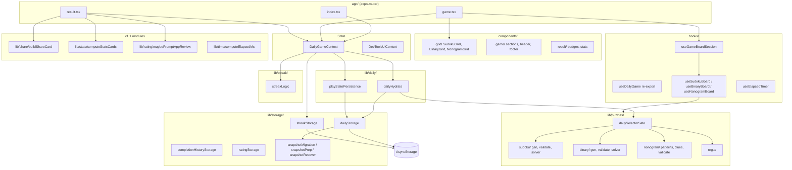

<!-- generated-by: gsd-doc-writer -->

# Architecture — 傻了么 (Silly Me)

## System overview

傻了么 is an offline-first Expo (React Native) daily puzzle app. Each local calendar day, the app assigns exactly one puzzle—**9×9 Sudoku**, **8×8 Binary (Takuzu/Binairo)**, or **8×8 Nonogram (Picross)**—derived deterministically from that day’s `dateKey` and a client-side seed salt. Users play in-app, progress is saved locally, and completion or surrender routes to a result screen with humorous copy (Nonogram wins also show a pattern reveal card). There is no network dependency for puzzle generation, validation, or persistence. v1.1 adds clipboard copy and optional system in-app review prompts only (no backend). **v1.2** adds system locale **zh/en** (`expo-localization`, English brand **Silly Me**), bilingual privacy, and dev-only settings placeholder for locale preview.

The architecture is layered: **expo-router screens** compose UI; **`DailyGameContext`** is the single source of truth for today’s game; **`lib/daily/`** orchestrates hydrate/build flows without React; **`lib/puzzles/`** holds pure TypeScript puzzle engines; **`lib/storage/`** reads/writes AsyncStorage with validation and migration; **`lib/streak/`** tracks consecutive-day check-ins on win. Styling uses NativeWind; animations use Reanimated on the result flow.

## Component diagram

## Data flow

### Cold start and routing

1. **`app/_layout.tsx`** mounts `DailyGameProvider` (and optional `DevToolsPanel` in `__DEV__`).
2. On mount, context runs **`hydrateDailyGame()`** (`lib/daily/dailyHydrate.ts`) in parallel with **`loadStreakState()`**.
3. **`app/index.tsx`** reads `status` from `useDailyGame()`:
   - `loading` → splash-style loading UI
   - `playing` → `<Redirect href="/game" />`
   - `completed` | `abandoned` → `<Redirect href="/result" />`

### Today’s puzzle: load or create

1. **`getLocalDateKey()`** (`lib/date/localDay.ts`) yields `YYYY-MM-DD` from the device local calendar (not UTC ISO slice).
2. **`loadDailySnapshot()`** (`lib/storage/dailyStorage.ts`) reads `@foolish-you/daily-v1`, parses JSON, runs **`migrateSnapshot()`** → **`normalizeSnapshotToV2()`** when needed.
3. If stored `dateKey` matches today: **`prepareTodaySnapshot()`** repairs placeholders / consistency, ensures `playState`, re-saves.
4. If missing or stale date: **`buildNewDailySnapshot()`** calls **`selectDailyGameSafe()`** (wraps `selectDailyGame` with solvability checks and deterministic fallback puzzles). Writes a new `DailySnapshot` with `status: 'playing'`.
5. On load/save, **`recoverSnapshot()`** may repair inconsistent puzzles or drop invalid `playState` when `status: 'completed'` but the board is incomplete (preserves streak/outcome).

### In-game play state

1. **`app/game.tsx`** uses **`useGameBoardSession`** → **`useSudokuBoard`**, **`useBinaryBoard`**, or **`useNonogramBoard`** for cell edits, conflicts (Sudoku/Binary only), and completion checks.
2. Board hooks call **`updatePlayState`** from context, implemented by **`usePlayStatePersistence`** (`lib/daily/playStatePersistence.ts`): optimistic React state update, debounced **`saveDailySnapshot`** (`PLAY_STATE_DEBOUNCE_MS` = 300ms).
3. On app background/inactive, context **`flushPlayState()`** so pending cells are not lost.
4. On app foreground (`active`), context re-**`hydrate()`** so a calendar rollover picks up a new day.

### Complete / abandon

1. **`markCompleted`** / **`markAbandoned`** merge pending play state, set `status` and `finishedAt`, **`persistSnapshot`** to AsyncStorage.
2. On **`completed`**, **`applyCheckIn()`** updates streak and **`saveStreakState()`** to `@foolish-you/streak-v1`.
3. On **`completed`**, append **`recordCompletion()`** to completion history (for weekly stats / backfill).
4. Router sends user to **`app/result.tsx`** (via index redirect or game navigation).
5. Result screen builds optional **share text** from `playState` + puzzle; shows **stats cards** from streak + history; may **`maybePromptAppReview()`** after gated delay.

### Daily determinism

| Input | Role |
|-------|------|
| `dateKey` | Local calendar day string |
| `APP_SALT` (`constants/config.ts`) | Public salt in client; not a secret |
| `deriveSeed(dateKey)` | FNV-style hash → 32-bit seed (`lib/puzzles/rng.ts`) |
| `mulberry32` + `deriveSubSeed` | Game-type pick and generator attempts |

Same `dateKey` + app version → same `seed`, same game type (unless dev override), same puzzle payload and `puzzleHash`. Generators are pure functions; no server or remote config.

### Offline-first constraints

- Puzzle generation, validation, and solving live entirely under **`lib/puzzles/`**.
- Persistence uses **`@react-native-async-storage/async-storage`** only; no API routes or sync. v1.1 uses **`expo-clipboard`** and **`expo-store-review`** locally (no backend).
- Copy and rules live in **`lib/copy/`**; no CDN fetch for core gameplay.
- Auth screen **`app/(auth)/login.tsx`** is a placeholder; not part of the daily loop.

## Key abstractions

| Abstraction | Location | Purpose |
|-------------|----------|---------|
| `DailySnapshot` | `lib/puzzles/types.ts` | Canonical persisted record: version, dateKey, gameType, seed, status, puzzle, puzzleHash, playState, timestamps |
| `PuzzlePayload` / `PlayState` | `lib/puzzles/types.ts` | Discriminated sudoku, binary, or nonogram puzzle and grid state |
| `selectDailyGame` | `lib/puzzles/dailySelector.ts` | Deterministic daily type + puzzle selection |
| `selectDailyGameSafe` | `lib/puzzles/dailySelectorSafe.ts` | Solvability-checked selection + fallback |
| `recoverSnapshot` | `lib/storage/snapshotRecover.ts` | Repair puzzle / strip contradictory playState |
| `buildShareCard` | `lib/share/buildShareCard.ts` | Emoji grid share payload for clipboard |
| `computeStatsCards` | `lib/stats/computeStatsCards.ts` | Result page three stat cards |
| `hydrateDailyGame` / `buildNewDailySnapshot` | `lib/daily/dailyHydrate.ts` | Non-React orchestration for load/create today |
| `usePlayStatePersistence` | `lib/daily/playStatePersistence.ts` | Debounced play-state writes and flush on lifecycle |
| `DailyGameContext` / `useDailyGame` | `contexts/DailyGameContext.tsx`, `hooks/useDailyGame.ts` | App-wide daily state, streak UI fields, complete/abandon |
| `migrateSnapshot` / `sanitizeSnapshotForSave` | `lib/storage/snapshotMigration.ts`, `snapshotValidate.ts` | Safe upgrades (v1→v2) and save-time consistency |
| `StreakState` / `applyCheckIn` | `lib/streak/types.ts`, `streakLogic.ts` | Consecutive local-day wins + `historicalMax` |
| `useSudokuBoard` / `useBinaryBoard` / `useNonogramBoard` | `hooks/useSudokuBoard.ts`, `useBinaryBoard.ts`, `useNonogramBoard.ts` | Ephemeral board logic wired to context updates |
| `getLocalDateKey` | `lib/date/localDay.ts` | Single definition of “today” for product rules |

## Directory structure rationale

| Path | Responsibility |
|------|----------------|
| **`app/`** | File-based routes only: entry redirect (`index`), play (`game`), outcome (`result`), legal (`privacy`), auth stub (`(auth)/login`). No puzzle algorithms here. |
| **`contexts/`** | React providers: **`DailyGameContext`** (canonical daily + persistence orchestration), **`DevToolsUiContext`** (dev panel layout). |
| **`hooks/`** | Thin or focused hooks: re-export **`useDailyGame`**, board sessions, elapsed timer, screen actions. Avoid duplicating context orchestration. |
| **`components/grid/`** | Sudoku/Binary/Nonogram grids and numpad—presentation and gestures. |
| **`components/game/`** | Game screen chrome: header, footer, rules, per-type sections. |
| **`components/result/`** | Result animations and stat presentation. |
| **`components/ui/`** | Shared primitives (e.g. `OutlinePillButton`, `HairlineCard`). |
| **`components/dev/`** | `DevToolsPanel` — `__DEV__` only; force game type, regenerate today. |
| **`lib/puzzles/`** | All generation, validation, solving, hashing, RNG, and shared types. Unit-tested heavily. |
| **`lib/puzzles/sudoku/`** | 9×9 generator, validator, solver, display helpers. |
| **`lib/puzzles/binary/`** | 8×8 Takuzu generator, validator, solver, spec. |
| **`lib/puzzles/nonogram/`** | 8×8 pattern library, clue derivation, mirror transforms, completion validator. |
| **`lib/daily/`** | Hydrate/build snapshot, debounced persistence hook, save-failure alert copy. |
| **`lib/storage/`** | AsyncStorage I/O, snapshot migration/prep/legacy, streak storage. |
| **`lib/streak/`** | Streak types and calendar-day check-in logic (separate key from daily snapshot). |
| **`lib/date/`** | Local calendar `dateKey` helper. |
| **`lib/copy/`** | User-facing strings (results, rules, streak line, privacy). |
| **`lib/platform/`** | Small RN helpers (`runAfterInteractions`, `exitApp`). |
| **`constants/`** | Storage keys, version, debounce, design tokens, dev flags. |
| **`__tests__/`** | Jest: `lib/` unit tests, `contexts/` and `screens/` RTL. |

## Persistence model

Two AsyncStorage keys (see `constants/config.ts`):

| Key | Content |
|-----|---------|
| `@foolish-you/daily-v1` | One `DailySnapshot` for the current or last played day; replaced when `dateKey` changes |
| `@foolish-you/streak-v1` | `StreakState`: `currentStreak`, `lastCheckInDateKey`, `historicalMax` (schema v2) |
| `@foolish-you/completion-history-v1` | Rolling completion records for stats / backfill |
| `@foolish-you/rating-v1` | Rating prompt counters / last prompt date |
| `@foolish-you/snapshot-recovery-log-v1` | Ring buffer of recovery events (dev-visible) |

Save path: in-memory snapshot → **`sanitizeSnapshotForSave`** → JSON → AsyncStorage. Failed saves surface `saveError` and retry via **`retrySave`** / save-failure alert (`lib/daily/saveFailureAlert.ts`). **`STORAGE_VERSION`** (currently `2`) bumps when persisted shape changes; older installs migrate on read, not by wiping user progress silently.

## Extension points (v1 scope)

- **New game type**: extend `GameType`, add generator under `lib/puzzles/`, branch in `dailySelector` / `isSolvable` and grid components; keep determinism via `deriveSubSeed`.
- **New screens**: add route under `app/`, consume `useDailyGame()`; do not fork daily orchestration into hooks.
- **Backend / auth**: reserved; must not break offline daily loop or deterministic seeds without explicit product approval.
